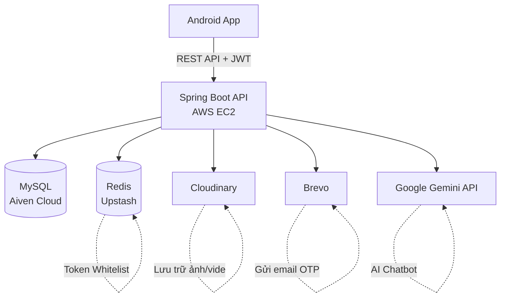
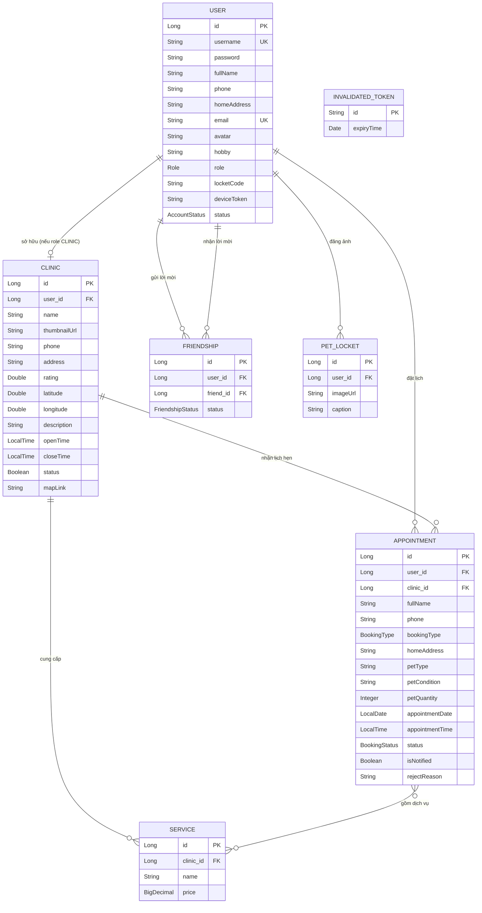
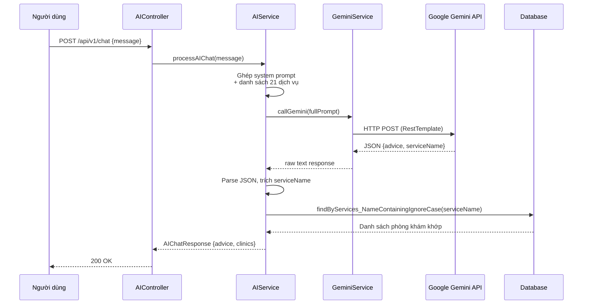

# Nhịp Đập Thú Cưng (HIT-ComeMyWay)

> Nền tảng kết nối người nuôi thú cưng với phòng khám thú y — tư vấn AI, đặt lịch khám, và mạng xã hội chia sẻ khoảnh khắc cùng thú cưng.

---

## Tính năng chính

### Người dùng (User)

- **Đăng ký / Đăng nhập** — Tạo tài khoản, xác thực qua JWT, quên mật khẩu qua email OTP
- **Tìm kiếm & đặt lịch phòng khám** (MVP chính) — Tìm theo dịch vụ, địa điểm, đặt lịch trực tiếp trong app
- **AI Chatbot tư vấn y tế** — Mô tả triệu chứng, nhận tư vấn sơ bộ và gợi ý phòng khám phù hợp (Google Gemini API)
- **Pet Locket** — Mạng xã hội chia sẻ ảnh thú cưng, kết bạn qua mã locket
- **Quản lý thông tin cá nhân** — Cập nhật hồ sơ, đổi mật khẩu, xem lịch sử đặt khám

### Phòng khám (Clinic)

- **Đăng ký / Đăng nhập** — Tạo tài khoản phòng khám, xác thực qua JWT
- **Duyệt / Từ chối lịch khám** — Xem chi tiết yêu cầu đặt lịch từ người dùng, phản hồi xác nhận hoặc từ chối kèm lý do
- **Quản lý thông tin phòng khám** — Cập nhật hồ sơ, giờ mở cửa, danh sách dịch vụ cung cấp

---

## Tech Stack

### Backend

| Thành phần | Công nghệ |
|---|---|
| Framework | Java 21, Spring Boot 3.x |
| Database | MySQL 8.0 (JPA/Hibernate) |
| Cache & Rate Limiting | Redis (Upstash) |
| Bảo mật | Spring Security, JWT + Refresh Token |
| Media | Cloudinary |
| Email OTP | Brevo (Sendinblue) |
| AI Chatbot | Google Gemini API (`gemini-3.5-flash-lite`) |
| API Docs | Swagger UI / OpenAPI 3.0 |
| Deploy | AWS EC2 (t3.small) |

### Frontend

| Thành phần | Công nghệ |
|---|---|
| Mobile | Android (Kotlin) |

---

## Kiến trúc hệ thống



---

## Sơ đồ cơ sở dữ liệu



**Ghi chú:**
- Mọi entity kế thừa `BaseEntity` (`createdAt`, `updatedAt` tự động gán qua `@PrePersist`/`@PreUpdate`)
- `INVALIDATED_TOKEN` đứng độc lập, dùng để lưu token đã bị thu hồi (logout) — không có quan hệ khóa ngoại
- `APPOINTMENT` — `SERVICE` là quan hệ nhiều-nhiều qua bảng trung gian `appointment_services`
- `Friendship` có ràng buộc `UNIQUE(user_id, friend_id)` và index trên `(user_id, status)`, `(friend_id, status)` để tối ưu truy vấn danh sách bạn bè theo trạng thái

---

## Luồng xử lý AI Chatbot



---

## Điểm kỹ thuật nổi bật

- **JWT + Refresh Token Whitelist**: Xác thực stateless kết hợp whitelist trong Redis, đảm bảo token bị thu hồi ngay khi logout
- **Rate Limiting bằng Redis**: Giới hạn 5 request/phút/IP trên endpoint login & register, chống brute-force
- **Tối ưu N+1 Query**: Sử dụng JOIN FETCH và `@BatchSize` khi tìm kiếm phòng khám, giảm đáng kể số lần truy vấn DB
- **AI làm bộ phân loại**: Prompt engineering ép Gemini trả về JSON có cấu trúc gồm lời tư vấn + tên dịch vụ y tế, sau đó dùng kết quả để query phòng khám có chuyên khoa tương ứng trong DB
- **Kiểm thử tải (k6)**: Mô phỏng 20 người dùng đồng thời — p(95) = 751ms, tỉ lệ lỗi 0%

---

## Hướng dẫn chạy local

### Yêu cầu

- Java 21+
- Maven
- MySQL 8.0
- Redis (hoặc tài khoản Upstash)

### Cấu hình biến môi trường

Tạo file `.env` ở thư mục `backend/`:

```env
DB_URL=jdbc:mysql://localhost:3306/pet_heartbeat_db?createDatabaseIfNotExist=true&useSSL=false&allowPublicKeyRetrieval=true&serverTimezone=Asia/Ho_Chi_Minh
DB_USERNAME=your_username
DB_PASSWORD=your_password

JWT_SECRET=your_jwt_secret_key
JWT_ACCESS_EXPIRATION=900000
JWT_REFRESH_EXPIRATION=604800000

REDIS_HOST=your_redis_host
REDIS_PORT=6379
REDIS_PASSWORD=your_redis_password

BREVO_API_KEY=your_brevo_api_key
BREVO_SENDER_EMAIL=your_sender_email

CLOUDINARY_CLOUD_NAME=your_cloud_name
CLOUDINARY_API_KEY=your_cloudinary_api_key
CLOUDINARY_API_SECRET=your_cloudinary_api_secret

GEMINI_API_KEY=your_gemini_api_key
```

### Chạy backend

```bash
cd backend
mvn spring-boot:run
```

API sẽ chạy tại `http://localhost:8080`
Swagger UI: `http://localhost:8080/swagger-ui/index.html`

---

## Đội ngũ

| Thành viên | Vai trò |
|---|---|
| Nguyễn Viết Khánh | Backend Developer |
| Phan Mai Hương | Backend Developer |
| Nguyễn Tiến Đạt | Android Developer |
| Bùi Thu Uyên | UI/UX Designer |
| Tạ Phương Anh | Tester / BA / PM |

### Mentor hướng dẫn

| Mảng | Mentor |
|---|---|
| Spring Boot | Phạm Minh Khương, Nguyễn Trọng Cường, Khương Xuân Toàn |
| Android | Trần Tuấn Anh, Trịnh Thanh Quân |
| UI/UX | Nguyễn Thị Thuý Quỳnh |
| Tester/BA | Nguyễn Thị Mỹ Duyên |

---

## Hướng phát triển

- **Tra cứu triệu chứng bệnh qua hình ảnh**: người dùng chụp ảnh vùng tổn thương của thú cưng, hệ thống trích xuất vector đặc trưng và so khớp độ tương đồng (cosine similarity) để phân loại sơ bộ tình trạng bệnh và gợi ý phòng khám có chuyên khoa phù hợp

---

## License

Dự án được thực hiện trong khuôn khổ CLB HIT — Đại học Công Nghiệp Hà Nội.
